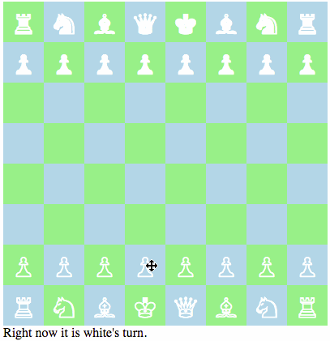

# chess-redux

React/Redux chess game using react-dnd. This game began as a tool to learn how to use higher-order components, by following the React Drag and Drop tutorial by Dan Abramov located at https://gaearon.github.io/react-dnd/docs-tutorial.html . The extension to full chess was implemented independently afterwards.

## Getting Started

To run locally, clone, then run `npm install`.

When that's done, run `gulp` and the browser page will automatically open.

Then, simply click on a piece to get started!

Game play follows normal chess, and rules enabled include castling and the special first-move for pawns.

